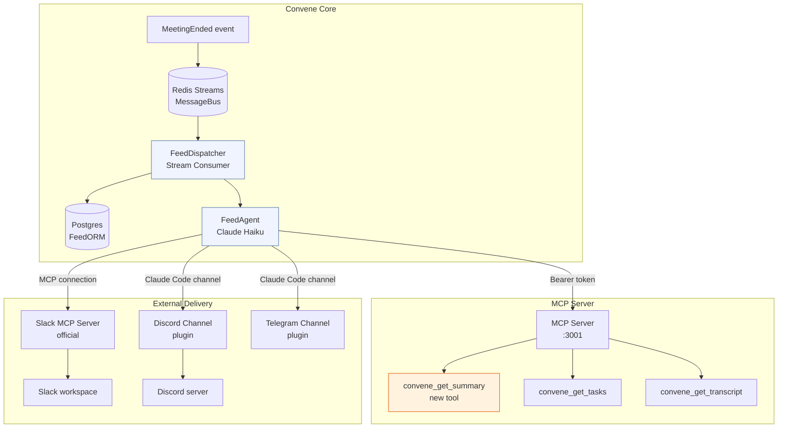

# Convene Feeds — Architecture Design

**Status:** Draft
**Date:** 2026-03-25
**Author:** Claude Sonnet 4.6 / Jon Dyer

---

## 1. Overview

Convene Feeds is an outbound integration layer that pushes meeting data to external platforms after meetings end (or on-demand). The key design principle: **a Convene agent is the delivery mechanism**. There is no custom API code, no platform SDKs, and no per-platform auth logic in the core — delivery happens through Claude Code channels (Discord, Telegram, Slack) or MCP servers that the agent already knows how to use.

### How It Fits the Existing Architecture



The FeedDispatcher consumes `meeting.ended` events from Redis Streams, looks up configured Feeds for the meeting's owner, and spins up a short-lived FeedAgent for each active Feed. The agent reads meeting data via the MCP server and delivers it through whichever channel/MCP the Feed is configured to use.

---

## 2. Feed Data Model

### FeedORM (new table: `feeds`)

```python
class FeedORM(Base):
    __tablename__ = "feeds"

    id: Mapped[UUID] = mapped_column(primary_key=True, default=uuid4)
    user_id: Mapped[UUID] = mapped_column(ForeignKey("users.id"), index=True)

    # Identity
    name: Mapped[str] = mapped_column(String(120))          # "Post-meeting Slack recap"
    is_active: Mapped[bool] = mapped_column(default=True)

    # Delivery
    platform: Mapped[str] = mapped_column(String(40))       # "slack", "discord", "notion", …
    delivery_type: Mapped[str] = mapped_column(String(20))  # "mcp" | "channel"

    # For delivery_type == "mcp"
    mcp_server_url: Mapped[str | None] = mapped_column(Text)   # e.g. https://mcp.slack.com/…
    mcp_auth_token: Mapped[str | None] = mapped_column(Text)   # encrypted at rest

    # For delivery_type == "channel"
    channel_name: Mapped[str | None] = mapped_column(String(80))  # e.g. "discord-general"

    # What to push
    data_types: Mapped[list[str]] = mapped_column(JSONB, default=list)
    # allowed values: "summary" | "transcript" | "tasks" | "decisions"

    # Trigger
    trigger: Mapped[str] = mapped_column(String(40), default="meeting_ended")
    # allowed values: "meeting_ended" | "participant_left" | "manual"

    # Scoping (optional — null means all meetings for this user)
    meeting_tag: Mapped[str | None] = mapped_column(String(80))

    # Audit
    created_at: Mapped[datetime] = mapped_column(default=func.now())
    updated_at: Mapped[datetime] = mapped_column(default=func.now(), onupdate=func.now())
    last_triggered_at: Mapped[datetime | None] = mapped_column(nullable=True)
    last_error: Mapped[str | None] = mapped_column(Text, nullable=True)
```

### FeedRunORM (new table: `feed_runs`)

Tracks every delivery attempt for observability and retry.

```python
class FeedRunORM(Base):
    __tablename__ = "feed_runs"

    id: Mapped[UUID] = mapped_column(primary_key=True, default=uuid4)
    feed_id: Mapped[UUID] = mapped_column(ForeignKey("feeds.id"), index=True)
    meeting_id: Mapped[UUID] = mapped_column(ForeignKey("meetings.id"), index=True)
    trigger: Mapped[str] = mapped_column(String(40))
    status: Mapped[str] = mapped_column(String(20), default="pending")
    # "pending" | "running" | "delivered" | "failed"
    agent_session_id: Mapped[str | None] = mapped_column(String(80))
    started_at: Mapped[datetime] = mapped_column(default=func.now())
    finished_at: Mapped[datetime | None] = mapped_column(nullable=True)
    error: Mapped[str | None] = mapped_column(Text, nullable=True)
```

### Pydantic models (API layer)

```python
class FeedBase(BaseModel):
    name: str
    platform: str
    delivery_type: Literal["mcp", "channel"]
    mcp_server_url: str | None = None
    channel_name: str | None = None
    data_types: list[Literal["summary", "transcript", "tasks", "decisions"]]
    trigger: Literal["meeting_ended", "participant_left", "manual"] = "meeting_ended"
    meeting_tag: str | None = None

class FeedCreate(FeedBase):
    mcp_auth_token: str | None = None   # write-only, encrypted before persist

class FeedRead(FeedBase):
    id: UUID
    user_id: UUID
    is_active: bool
    created_at: datetime
    last_triggered_at: datetime | None
    last_error: str | None
```

---

## 3. Event-Driven Dispatch

### FeedDispatcher (new stream consumer in `services/worker/`)

The FeedDispatcher is a new consumer that runs inside the existing worker service alongside the Slack bot. It subscribes to `convene:events` on the `feed-dispatcher` consumer group.

```
convene:events (Redis Stream)
       │
       ▼ event_type == "meeting.ended"
  FeedDispatcher
       │
       ├─ query DB: SELECT * FROM feeds WHERE user_id = meeting.owner_id AND is_active
       │
       ├─ for each matching Feed (trigger == "meeting_ended"):
       │       insert FeedRun(status="pending")
       │       enqueue FeedAgent task via Redis Streams: convene:feed-runs
       │
       └─ ack message
```

**Why not dispatch synchronously?** Feed agents may take 10–30 seconds (LLM calls, external API round-trips). Dispatching asynchronously via a second stream decouples latency and allows retries.

### FeedRunner (consumes `convene:feed-runs`)

A second consumer in the worker that picks up `FeedRun` records and actually launches the agent:

```python
async def run_feed(feed: FeedORM, run: FeedRunORM, meeting_id: UUID) -> None:
    agent = build_feed_agent(feed)       # see §4
    await agent.execute(meeting_id)
    await update_run(run.id, status="delivered")
```

Retry policy: exponential backoff, max 3 attempts per FeedRun. On final failure, `last_error` is written to `FeedORM` and a `feed.run.failed` event is published so the UI can surface it.

---

## 4. Agent Delivery Pattern

### The FeedAgent

The FeedAgent is a short-lived Claude Haiku agent instantiated per-delivery. It receives:
- The meeting ID
- A system prompt describing what to fetch and where to send it
- Access to the Convene MCP server (to read meeting data)
- Access to the delivery MCP or channel (to send data outbound)

```
FeedAgent (Haiku)
    │
    ├── Convene MCP tools (read side)
    │       convene_get_summary(meeting_id)    ← new tool
    │       convene_get_tasks(meeting_id)
    │       convene_get_transcript(meeting_id)
    │
    └── Delivery mechanism (write side)
            ── MCP: Slack MCP / Notion MCP / GitHub MCP
            ── Channel: Discord channel / Telegram channel
```

### System Prompt Template

```
You are a Convene delivery agent. Your job is to push meeting data to {platform}.

Meeting ID: {meeting_id}
Deliver: {data_types}  (e.g. summary, tasks)

Steps:
1. Use convene_get_summary / convene_get_tasks / convene_get_transcript as needed.
2. Format the data appropriately for {platform}.
3. Deliver it using the {delivery_mechanism} tools available to you.
4. Confirm delivery and stop.

Do not include raw transcript unless explicitly requested.
Be concise — this is a notification, not a report.
```

### Channel vs MCP Delivery

| Delivery type | How configured | Agent toolset |
|---|---|---|
| `mcp` | `mcp_server_url` + `mcp_auth_token` | Claude SDK connects the agent to the target MCP server at runtime — agent gets native MCP tools (e.g. `slack_post_message`) |
| `channel` | `channel_name` | Claude Code channel plugin provides the channel as a tool (e.g. `send_discord_message`); the agent calls it directly |

For MCP delivery the FeedRunner passes the external MCP server URL and token when building the agent's MCP client list. The agent transparently discovers the available tools (e.g. `slack_post_message`, `notion_create_page`) and uses them.

For channel delivery the FeedRunner configures the Claude Code channel plugin, which exposes a `send_message(channel, content)` tool to the agent.

---

## 5. Channel Adapter Pattern

The `ChannelAdapter` ABC abstracts the difference between MCP servers and Claude Code channels so `FeedRunner` doesn't need to know which type a Feed uses.

```python
# packages/convene-core/src/convene_core/feeds/adapters.py

from abc import ABC, abstractmethod

class ChannelAdapter(ABC):
    """Configures a FeedAgent's outbound delivery mechanism."""

    @abstractmethod
    def mcp_servers(self) -> list[MCPServerConfig]:
        """MCP servers to attach to the agent (empty for channel-only delivery)."""
        ...

    @abstractmethod
    def system_prompt_suffix(self) -> str:
        """Platform-specific instructions appended to the base system prompt."""
        ...


class MCPChannelAdapter(ChannelAdapter):
    """Delivery via an MCP server (Slack, Notion, GitHub, etc.)."""

    def __init__(self, server_url: str, auth_token: str, platform: str) -> None:
        self._server_url = server_url
        self._auth_token = auth_token
        self._platform = platform

    def mcp_servers(self) -> list[MCPServerConfig]:
        return [MCPServerConfig(url=self._server_url, token=self._auth_token)]

    def system_prompt_suffix(self) -> str:
        return f"Use the {self._platform} MCP tools to deliver the content."


class ClaudeCodeChannelAdapter(ChannelAdapter):
    """Delivery via a Claude Code channel plugin (Discord, Telegram, iMessage)."""

    def __init__(self, channel_name: str, platform: str) -> None:
        self._channel_name = channel_name
        self._platform = platform

    def mcp_servers(self) -> list[MCPServerConfig]:
        return []   # channel is injected via Claude Code channel config

    def system_prompt_suffix(self) -> str:
        return (
            f"Use the send_message tool to post to the '{self._channel_name}' "
            f"{self._platform} channel."
        )
```

### Adapter Registry

```python
ADAPTER_REGISTRY: dict[str, type[ChannelAdapter]] = {
    "slack":    MCPChannelAdapter,
    "notion":   MCPChannelAdapter,
    "github":   MCPChannelAdapter,
    "discord":  ClaudeCodeChannelAdapter,
    "telegram": ClaudeCodeChannelAdapter,
    "imessage": ClaudeCodeChannelAdapter,
}

def build_adapter(feed: FeedORM) -> ChannelAdapter:
    cls = ADAPTER_REGISTRY[feed.platform]
    if issubclass(cls, MCPChannelAdapter):
        return cls(feed.mcp_server_url, decrypt(feed.mcp_auth_token), feed.platform)
    return cls(feed.channel_name, feed.platform)
```

Adding a new platform is one line in the registry plus, if it's a new delivery type, a new `ChannelAdapter` subclass. No core changes required.

---

## 6. `convene_get_summary` — New MCP Tool

This is the only new MCP tool required. The existing `convene_get_tasks` and `convene_get_transcript` tools already cover the other data types.

### Tool Design

**Name:** `convene_get_summary`
**Purpose:** Return a structured meeting summary (title, key points, decisions, action item count).
**Implementation:** Calls the task-engine's existing LLM pipeline or reads a cached `MeetingSummaryORM` row.

```python
@mcp.tool()
async def convene_get_summary(
    meeting_id: str,
    ctx: Context,
) -> dict[str, Any]:
    """Get a structured summary for a completed meeting.

    Returns title, duration, participant count, key discussion points,
    recorded decisions, and action item count. Suitable for external
    distribution without exposing raw transcript data.

    Args:
        meeting_id: UUID of the meeting.

    Returns:
        dict with keys: meeting_id, title, duration_minutes, participant_count,
        key_points (list[str]), decisions (list[str]), task_count, ended_at.
    """
    ...
```

### Where the Summary Comes From

Phase 1: generate on-demand using a short Haiku call over the stored transcript segments. Cache result in a new `meeting_summaries` table.
Phase 2: pre-generate summaries as part of the existing task-engine extraction pass so they are ready when `MeetingEnded` fires.

### Schema (`meeting_summaries` table)

```python
class MeetingSummaryORM(Base):
    __tablename__ = "meeting_summaries"

    id: Mapped[UUID] = mapped_column(primary_key=True, default=uuid4)
    meeting_id: Mapped[UUID] = mapped_column(ForeignKey("meetings.id"), unique=True)
    key_points: Mapped[list[str]] = mapped_column(JSONB)
    decisions: Mapped[list[str]] = mapped_column(JSONB)
    task_count: Mapped[int] = mapped_column(default=0)
    generated_at: Mapped[datetime] = mapped_column(default=func.now())
    model_used: Mapped[str] = mapped_column(String(60))
```

---

## 7. Configuration UI

### Feed List (Settings → Feeds)

```
┌─────────────────────────────────────────────────────────┐
│  Feeds                                    [+ New Feed]  │
├─────────────────────────────────────────────────────────┤
│  ● Post-meeting recap → Slack #general                  │
│    Trigger: Meeting ended | Sends: Summary + Tasks      │
│    Last run: 2 hours ago  [Edit] [Disable] [Run now]    │
├─────────────────────────────────────────────────────────┤
│  ● Daily tasks → Notion database                        │
│    Trigger: Meeting ended | Sends: Tasks                │
│    Last run: Yesterday    [Edit] [Disable] [Run now]    │
└─────────────────────────────────────────────────────────┘
```

### New/Edit Feed Form

```
Name:        [Post-meeting recap          ]

Platform:    [Slack ▼]

Delivery:    (●) MCP Server   ( ) Channel

MCP Server URL:   [https://mcp.slack.com/…  ]
MCP Auth Token:   [••••••••••••             ] (write-only)

Deliver:     [x] Summary   [x] Tasks   [ ] Transcript   [ ] Decisions

Trigger:     (●) After meeting ends
             ( ) When a participant leaves
             ( ) Manually only

Filter by tag: [optional                   ]

                              [Cancel]  [Save Feed]
```

### API Endpoints (services/api-server/)

```
GET    /feeds              → list feeds for current user
POST   /feeds              → create a feed
GET    /feeds/{id}         → get a feed
PATCH  /feeds/{id}         → update a feed
DELETE /feeds/{id}         → delete a feed
POST   /feeds/{id}/trigger → manually trigger a feed run (meeting_id in body)
GET    /feeds/{id}/runs    → list recent FeedRun records for a feed
```

All endpoints use the existing `get_current_user` JWT dependency.

---

## 8. Build Phases

### Phase 1 — Core Pipeline + Slack via MCP

**Goal:** End-to-end delivery: meeting ends → Slack message sent.

Tasks:
- [ ] `FeedORM` + `FeedRunORM` migration
- [ ] `MeetingSummaryORM` migration
- [ ] `convene_get_summary` MCP tool (on-demand Haiku generation)
- [ ] `FeedDispatcher` stream consumer in worker service
- [ ] `FeedRunner` consumer + `build_feed_agent()` utility
- [ ] `MCPChannelAdapter` + `build_adapter()` registry
- [ ] API endpoints: CRUD + manual trigger
- [ ] Slack Feed integration test (manual trigger → Slack)

**Milestone:** A user configures a Slack Feed, manually triggers it, and a structured message appears in their Slack channel.

### Phase 2 — Event-Driven + Discord + Configuration UI

**Goal:** Automatic post-meeting delivery with UI.

Tasks:
- [ ] Wire `FeedDispatcher` to `meeting.ended` events (replaces manual-only trigger)
- [ ] `ClaudeCodeChannelAdapter` for Discord channel delivery
- [ ] Discord Feed integration test
- [ ] Feed list + create/edit UI in `web/`
- [ ] Feed run history UI (Settings → Feeds → {feed} → Runs)
- [ ] Error surfacing: `last_error` visible in UI + `feed.run.failed` event

**Milestone:** After a real meeting ends, a Discord message and a Slack message are automatically delivered within 60 seconds.

### Phase 3 — Additional Platforms + Pre-generated Summaries

**Goal:** Broad platform coverage and faster delivery.

Tasks:
- [ ] Pre-generate summaries in task-engine extraction pass (eliminate on-demand Haiku call)
- [ ] Notion MCP adapter + integration test
- [ ] GitHub MCP adapter (post meeting notes as a Gist or issue)
- [ ] Telegram channel adapter
- [ ] `participant_left` trigger
- [ ] Per-meeting tag filtering (so a Feed only fires for tagged meetings)
- [ ] Feed run retry UI (manually re-run a failed delivery)

**Milestone:** All Phase 1–3 platforms have integration tests. Summary pre-generation reduces delivery latency to < 10 seconds.

---

## 9. What NOT to Build

These anti-patterns are explicitly out of scope and should be rejected in code review:

| Anti-pattern | Why not |
|---|---|
| Direct Slack API calls (`slack_sdk`, `requests.post(webhook_url)`) | Ties core to a platform. Use Slack MCP instead. |
| OAuth flows per platform in the API server | Platform auth is handled by the MCP server or channel plugin. We store a token, not auth code flows. |
| Custom webhook handlers for incoming platform events | Feeds is outbound only. Inbound webhooks are a separate feature. |
| Platform-specific formatting logic in `FeedRunner` | All formatting is delegated to the FeedAgent's LLM. |
| Hard-coded platform names anywhere except `ADAPTER_REGISTRY` | Any platform logic outside the registry breaks portability. |
| Long-running agents attached to meetings | FeedAgents are short-lived, single-purpose, and ephemeral. |
| Reading transcript segments directly in `FeedDispatcher` | Dispatcher only queries Feed config. Data access is the agent's job via MCP tools. |
| `worker` service making HTTP calls to other Convene services | All cross-service data flows through the MessageBus or the MCP server. |

---

## 10. Open Questions

1. **Token encryption** — `mcp_auth_token` must be encrypted at rest. We need a key management decision (KMS vs. Fernet with app secret). Phase 1 can use Fernet with `SECRET_KEY` from env; phase 3 should evaluate KMS for enterprise tier.

2. **Agent identity** — Should FeedAgents appear in meeting participant lists? Current thinking: no — they are post-meeting, not in-meeting. They connect to the MCP server directly, not through the agent-gateway.

3. **Summary quality** — On-demand Haiku generation from raw segments may produce variable quality. Consider a fixed extraction prompt with structured output (JSON mode) to guarantee `key_points` and `decisions` fields are always present.

4. **Rate limiting** — Slack MCP and channel plugins have their own rate limits. `FeedRunner` should honor a configurable `max_concurrent_feed_agents` (default: 3) to avoid hammering external APIs after large meetings.

5. **Enterprise scoping** — Should Feeds be per-user or per-org? Phase 1: per-user. Phase 3: evaluate org-level Feeds for Business/Enterprise tiers.
