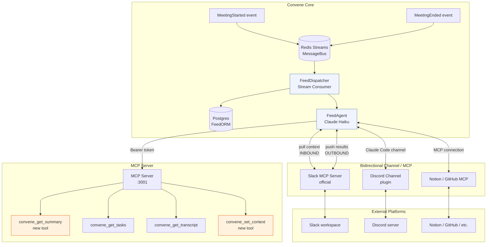

# Convene Feeds — Architecture Design

**Status:** Draft
**Date:** 2026-03-25
**Author:** Claude Sonnet 4.6 / Jon Dyer

---

## 1. Overview

Convene Feeds is a **bidirectional integration layer** for connecting external platforms to meetings. A Feed can **pull data in** (e.g., fetch a Slack thread or Notion page as meeting context before or during a meeting) and **push data out** (e.g., post a summary to Slack after the meeting ends). The same channel or MCP connection handles both directions — there is no separate inbound vs. outbound channel concept.

The key design principle: **a Convene agent is the integration mechanism**. There is no custom API code, no platform SDKs, and no per-platform auth logic in the core — both context retrieval and delivery happen through Claude Code channels (Discord, Telegram, Slack) or MCP servers that the agent already knows how to use.

### How It Fits the Existing Architecture



The FeedDispatcher consumes events from Redis Streams (`meeting.started` for inbound context pulls, `meeting.ended` for outbound delivery), looks up configured Feeds for the meeting's owner, and spins up a short-lived FeedAgent for each active Feed. For **inbound** Feeds the agent fetches external context (e.g., a linked Slack thread) and injects it into the meeting via the MCP server. For **outbound** Feeds the agent reads meeting data via the MCP server and delivers it to the configured channel or MCP destination. One Feed can be configured to do both.

---

## 2. Feed Data Model

### FeedORM (new table: `feeds`)

```python
class FeedORM(Base):
    __tablename__ = "feeds"

    id: Mapped[UUID] = mapped_column(primary_key=True, default=uuid4)
    user_id: Mapped[UUID] = mapped_column(ForeignKey("users.id"), index=True)

    # Identity
    name: Mapped[str] = mapped_column(String(120))          # "Post-meeting Slack recap"
    is_active: Mapped[bool] = mapped_column(default=True)

    # Delivery
    platform: Mapped[str] = mapped_column(String(40))       # "slack", "discord", "notion", …
    delivery_type: Mapped[str] = mapped_column(String(20))  # "mcp" | "channel"

    # For delivery_type == "mcp"
    mcp_server_url: Mapped[str | None] = mapped_column(Text)   # e.g. https://mcp.slack.com/…
    # NOTE: mcp_auth_token is NOT stored here — it lives in feed_secrets (see §9)

    # For delivery_type == "channel"
    channel_name: Mapped[str | None] = mapped_column(String(80))  # e.g. "discord-general"

    # Direction
    direction: Mapped[str] = mapped_column(String(20), default="outbound")
    # "inbound" | "outbound" | "bidirectional"
    # inbound: pull context from platform into meeting
    # outbound: push meeting data to platform
    # bidirectional: do both (same channel/MCP connection)

    # What to push (outbound)
    data_types: Mapped[list[str]] = mapped_column(JSONB, default=list)
    # allowed values: "summary" | "transcript" | "tasks" | "decisions"

    # What to pull (inbound) — null unless direction is "inbound" or "bidirectional"
    context_types: Mapped[list[str]] = mapped_column(JSONB, default=list)
    # allowed values: "thread" | "page" | "issue" | "document"
    # e.g. pull a linked Slack thread into meeting context at meeting_started

    # Trigger
    trigger: Mapped[str] = mapped_column(String(40), default="meeting_ended")
    # outbound triggers: "meeting_ended" | "participant_left" | "manual"
    # inbound triggers: "meeting_started" | "manual"

    # Scoping (optional — null means all meetings for this user)
    meeting_tag: Mapped[str | None] = mapped_column(String(80))

    # Audit
    created_at: Mapped[datetime] = mapped_column(default=func.now())
    updated_at: Mapped[datetime] = mapped_column(default=func.now(), onupdate=func.now())
    last_triggered_at: Mapped[datetime | None] = mapped_column(nullable=True)
    last_error: Mapped[str | None] = mapped_column(Text, nullable=True)
```

### FeedRunORM (new table: `feed_runs`)

Tracks every delivery attempt for observability and retry.

```python
class FeedRunORM(Base):
    __tablename__ = "feed_runs"

    id: Mapped[UUID] = mapped_column(primary_key=True, default=uuid4)
    feed_id: Mapped[UUID] = mapped_column(ForeignKey("feeds.id"), index=True)
    meeting_id: Mapped[UUID] = mapped_column(ForeignKey("meetings.id"), index=True)
    trigger: Mapped[str] = mapped_column(String(40))
    direction: Mapped[str] = mapped_column(String(20))  # "inbound" | "outbound"
    status: Mapped[str] = mapped_column(String(20), default="pending")
    # "pending" | "running" | "delivered" | "failed"
    agent_session_id: Mapped[str | None] = mapped_column(String(80))
    started_at: Mapped[datetime] = mapped_column(default=func.now())
    finished_at: Mapped[datetime | None] = mapped_column(nullable=True)
    error: Mapped[str | None] = mapped_column(Text, nullable=True)
```

### Pydantic models (API layer)

```python
class FeedBase(BaseModel):
    name: str
    platform: str
    direction: Literal["inbound", "outbound", "bidirectional"] = "outbound"
    delivery_type: Literal["mcp", "channel"]
    mcp_server_url: str | None = None
    channel_name: str | None = None
    data_types: list[Literal["summary", "transcript", "tasks", "decisions"]] = []
    context_types: list[Literal["thread", "page", "issue", "document"]] = []
    trigger: Literal["meeting_ended", "participant_left", "meeting_started", "manual"] = "meeting_ended"
    meeting_tag: str | None = None

class FeedCreate(FeedBase):
    mcp_auth_token: str | None = None   # write-only; never returned in responses, encrypted before persist

class FeedRead(FeedBase):
    id: UUID
    user_id: UUID
    is_active: bool
    created_at: datetime
    last_triggered_at: datetime | None
    last_error: str | None
```

---

## 3. Event-Driven Dispatch

### FeedDispatcher (new stream consumer in `services/worker/`)

The FeedDispatcher is a new consumer that runs inside the existing worker service alongside the Slack bot. It subscribes to `convene:events` on the `feed-dispatcher` consumer group.

```
convene:events (Redis Stream)
       │
       ├─ event_type == "meeting.started"
       │       ▼
       │  FeedDispatcher
       │       ├─ query DB: SELECT * FROM feeds WHERE user_id = meeting.owner_id
       │       │                                    AND is_active
       │       │                                    AND trigger == "meeting_started"
       │       ├─ for each matching Feed (inbound or bidirectional):
       │       │       insert FeedRun(status="pending", direction="inbound")
       │       │       enqueue FeedAgent task via Redis Streams: convene:feed-runs
       │       └─ ack message
       │
       └─ event_type == "meeting.ended"
               ▼
          FeedDispatcher
               ├─ query DB: SELECT * FROM feeds WHERE user_id = meeting.owner_id
               │                                    AND is_active
               │                                    AND trigger == "meeting_ended"
               ├─ for each matching Feed (outbound or bidirectional):
               │       insert FeedRun(status="pending", direction="outbound")
               │       enqueue FeedAgent task via Redis Streams: convene:feed-runs
               └─ ack message
```

**Why not dispatch synchronously?** Feed agents may take 10–30 seconds (LLM calls, external API round-trips). Dispatching asynchronously via a second stream decouples latency and allows retries.

### FeedRunner (consumes `convene:feed-runs`)

A second consumer in the worker that picks up `FeedRun` records and actually launches the agent:

```python
async def run_feed(feed: FeedORM, run: FeedRunORM, meeting_id: UUID) -> None:
    agent = build_feed_agent(feed)       # see §4
    await agent.execute(meeting_id)
    await update_run(run.id, status="delivered")
```

Retry policy: exponential backoff, max 3 attempts per FeedRun. On final failure, `last_error` is written to `FeedORM` and a `feed.run.failed` event is published so the UI can surface it.

---

## 4. Agent Delivery Pattern

### The FeedAgent

The FeedAgent is a short-lived Claude Haiku agent instantiated per-run. It receives:
- The meeting ID
- The run direction (`inbound` or `outbound`)
- A system prompt describing what to fetch and where to send it (or what to pull and where to inject it)
- Access to the Convene MCP server (to read meeting data or inject context)
- Access to the delivery/source MCP or channel (bidirectional — same connection for both pull and push)

```
FeedAgent (Haiku)
    │
    ├── Convene MCP tools
    │       convene_get_summary(meeting_id)       ← new tool (outbound)
    │       convene_get_tasks(meeting_id)          (outbound)
    │       convene_get_transcript(meeting_id)     (outbound)
    │       convene_set_context(meeting_id, ctx)   ← new tool (inbound)
    │
    └── External channel / MCP  ← BIDIRECTIONAL
            pull: slack_get_thread / notion_get_page / github_get_issue
            push: slack_post_message / notion_create_page / github_create_comment
            ── MCP: Slack MCP / Notion MCP / GitHub MCP
            ── Channel: Discord channel / Telegram channel
```

### System Prompt Templates

**Outbound (push meeting data to platform):**
```
You are a Convene delivery agent. Your job is to push meeting data to {platform}.

Meeting ID: {meeting_id}
Deliver: {data_types}  (e.g. summary, tasks)

Steps:
1. Use convene_get_summary / convene_get_tasks / convene_get_transcript as needed.
2. Format the data appropriately for {platform}.
3. Deliver it using the {delivery_mechanism} tools available to you.
4. Confirm delivery and stop.

Do not include raw transcript unless explicitly requested.
Be concise — this is a notification, not a report.
```

**Inbound (pull context from platform into meeting):**
```
You are a Convene context agent. Your job is to pull relevant context from {platform}
and inject it into the meeting before it starts.

Meeting ID: {meeting_id}
Context to pull: {context_types}  (e.g. thread, page)

Steps:
1. Use the {platform} tools to fetch the relevant context (linked thread, issue, doc, etc.).
2. Summarize or structure the context as appropriate.
3. Use convene_set_context(meeting_id, context) to inject it into the meeting.
4. Confirm injection and stop.

Be concise — participants will see this as a context sidebar, not a full document.
```

### Channel vs MCP Delivery

| Delivery type | How configured | Agent toolset | Bidirectional? |
|---|---|---|---|
| `mcp` | `mcp_server_url` + `mcp_auth_token` | Claude SDK connects the agent to the target MCP server — agent gets native MCP tools (e.g. `slack_post_message`, `slack_get_thread`) | Yes — MCP servers expose both read and write tools |
| `channel` | `channel_name` | Claude Code channel plugin provides the channel as tools (e.g. `send_discord_message`, `read_discord_messages`) | Yes — channel plugins support read and write |

For MCP delivery the FeedRunner passes the external MCP server URL and decrypted token when building the agent's MCP client list. The agent transparently discovers the available tools and uses whichever ones match the run direction.

For channel delivery the FeedRunner configures the Claude Code channel plugin, which exposes both `send_message(channel, content)` and `read_messages(channel)` tools to the agent.

---

## 5. Channel Adapter Pattern

The `ChannelAdapter` ABC abstracts the difference between MCP servers and Claude Code channels so `FeedRunner` doesn't need to know which type a Feed uses. Adapters are **bidirectional** — the same adapter instance is used whether the agent is pulling context in or pushing data out.

```python
# packages/convene-core/src/convene_core/feeds/adapters.py

from abc import ABC, abstractmethod
from enum import StrEnum

class FeedDirection(StrEnum):
    INBOUND = "inbound"
    OUTBOUND = "outbound"
    BIDIRECTIONAL = "bidirectional"


class ChannelAdapter(ABC):
    """
    Configures a FeedAgent's channel connection.

    The same adapter handles both inbound (pull context) and outbound
    (push results) — there is no separate inbound/outbound adapter.
    The agent's system prompt determines which direction(s) to execute.
    """

    @abstractmethod
    def mcp_servers(self) -> list[MCPServerConfig]:
        """MCP servers to attach to the agent (empty for channel-only feeds)."""
        ...

    @abstractmethod
    def system_prompt_suffix(self, direction: FeedDirection) -> str:
        """Platform-specific instructions appended to the base system prompt."""
        ...


class MCPChannelAdapter(ChannelAdapter):
    """Bidirectional adapter via an MCP server (Slack, Notion, GitHub, etc.)."""

    def __init__(self, server_url: str, auth_token: str, platform: str) -> None:
        self._server_url = server_url
        self._auth_token = auth_token
        self._platform = platform

    def mcp_servers(self) -> list[MCPServerConfig]:
        return [MCPServerConfig(url=self._server_url, token=self._auth_token)]

    def system_prompt_suffix(self, direction: FeedDirection) -> str:
        if direction == FeedDirection.INBOUND:
            return f"Use the {self._platform} MCP tools to fetch context and inject it."
        if direction == FeedDirection.OUTBOUND:
            return f"Use the {self._platform} MCP tools to deliver the content."
        return (
            f"Use the {self._platform} MCP tools — pull context at meeting start "
            f"and deliver results when the meeting ends."
        )


class ClaudeCodeChannelAdapter(ChannelAdapter):
    """Bidirectional adapter via a Claude Code channel plugin (Discord, Telegram, iMessage)."""

    def __init__(self, channel_name: str, platform: str) -> None:
        self._channel_name = channel_name
        self._platform = platform

    def mcp_servers(self) -> list[MCPServerConfig]:
        return []   # channel is injected via Claude Code channel config

    def system_prompt_suffix(self, direction: FeedDirection) -> str:
        if direction == FeedDirection.INBOUND:
            return (
                f"Use the read_messages tool to fetch context from the "
                f"'{self._channel_name}' {self._platform} channel."
            )
        return (
            f"Use the send_message tool to post to the '{self._channel_name}' "
            f"{self._platform} channel."
        )
```

### Adapter Registry

```python
ADAPTER_REGISTRY: dict[str, type[ChannelAdapter]] = {
    "slack":    MCPChannelAdapter,
    "notion":   MCPChannelAdapter,
    "github":   MCPChannelAdapter,
    "discord":  ClaudeCodeChannelAdapter,
    "telegram": ClaudeCodeChannelAdapter,
    "imessage": ClaudeCodeChannelAdapter,
}

def build_adapter(feed: FeedORM) -> ChannelAdapter:
    cls = ADAPTER_REGISTRY[feed.platform]
    if issubclass(cls, MCPChannelAdapter):
        return cls(feed.mcp_server_url, decrypt(feed.mcp_auth_token), feed.platform)
    return cls(feed.channel_name, feed.platform)
```

Adding a new platform is one line in the registry plus, if it's a new delivery type, a new `ChannelAdapter` subclass. No core changes required.

---

## 6. `convene_get_summary` — New MCP Tool

This is the only new MCP tool required. The existing `convene_get_tasks` and `convene_get_transcript` tools already cover the other data types.

### Tool Design

**Name:** `convene_get_summary`
**Purpose:** Return a structured meeting summary (title, key points, decisions, action item count).
**Implementation:** Calls the task-engine's existing LLM pipeline or reads a cached `MeetingSummaryORM` row.

```python
@mcp.tool()
async def convene_get_summary(
    meeting_id: str,
    ctx: Context,
) -> dict[str, Any]:
    """Get a structured summary for a completed meeting.

    Returns title, duration, participant count, key discussion points,
    recorded decisions, and action item count. Suitable for external
    distribution without exposing raw transcript data.

    Args:
        meeting_id: UUID of the meeting.

    Returns:
        dict with keys: meeting_id, title, duration_minutes, participant_count,
        key_points (list[str]), decisions (list[str]), task_count, ended_at.
    """
    ...
```

### Where the Summary Comes From

Phase 1: generate on-demand using a short Haiku call over the stored transcript segments. Cache result in a new `meeting_summaries` table.
Phase 2: pre-generate summaries as part of the existing task-engine extraction pass so they are ready when `MeetingEnded` fires.

### Schema (`meeting_summaries` table)

```python
class MeetingSummaryORM(Base):
    __tablename__ = "meeting_summaries"

    id: Mapped[UUID] = mapped_column(primary_key=True, default=uuid4)
    meeting_id: Mapped[UUID] = mapped_column(ForeignKey("meetings.id"), unique=True)
    key_points: Mapped[list[str]] = mapped_column(JSONB)
    decisions: Mapped[list[str]] = mapped_column(JSONB)
    task_count: Mapped[int] = mapped_column(default=0)
    generated_at: Mapped[datetime] = mapped_column(default=func.now())
    model_used: Mapped[str] = mapped_column(String(60))
```

---

## 7. Configuration UI

### Feed List (Settings → Feeds)

```
┌─────────────────────────────────────────────────────────┐
│  Feeds                                    [+ New Feed]  │
├─────────────────────────────────────────────────────────┤
│  ● Post-meeting recap → Slack #general                  │
│    Trigger: Meeting ended | Sends: Summary + Tasks      │
│    Last run: 2 hours ago  [Edit] [Disable] [Run now]    │
├─────────────────────────────────────────────────────────┤
│  ● Daily tasks → Notion database                        │
│    Trigger: Meeting ended | Sends: Tasks                │
│    Last run: Yesterday    [Edit] [Disable] [Run now]    │
└─────────────────────────────────────────────────────────┘
```

### New/Edit Feed Form

```
Name:        [Post-meeting recap          ]

Platform:    [Slack ▼]

Delivery:    (●) MCP Server   ( ) Channel

MCP Server URL:   [https://mcp.slack.com/…  ]
MCP Auth Token:   [••••••••••••             ] (write-only)

Deliver:     [x] Summary   [x] Tasks   [ ] Transcript   [ ] Decisions

Trigger:     (●) After meeting ends
             ( ) When a participant leaves
             ( ) Manually only

Filter by tag: [optional                   ]

                              [Cancel]  [Save Feed]
```

### API Endpoints (services/api-server/)

```
GET    /feeds              → list feeds for current user
POST   /feeds              → create a feed
GET    /feeds/{id}         → get a feed
PATCH  /feeds/{id}         → update a feed
DELETE /feeds/{id}         → delete a feed
POST   /feeds/{id}/trigger → manually trigger a feed run (meeting_id in body)
GET    /feeds/{id}/runs    → list recent FeedRun records for a feed
```

All endpoints use the existing `get_current_user` JWT dependency.

---

## 8. Build Phases

### Phase 1 — Core Pipeline + Slack via MCP

**Goal:** End-to-end delivery: meeting ends → Slack message sent.

Tasks:
- [ ] `FeedORM` + `FeedRunORM` migration
- [ ] `MeetingSummaryORM` migration
- [ ] `convene_get_summary` MCP tool (on-demand Haiku generation)
- [ ] `FeedDispatcher` stream consumer in worker service
- [ ] `FeedRunner` consumer + `build_feed_agent()` utility
- [ ] `MCPChannelAdapter` + `build_adapter()` registry
- [ ] API endpoints: CRUD + manual trigger
- [ ] Slack Feed integration test (manual trigger → Slack)

**Milestone:** A user configures a Slack Feed, manually triggers it, and a structured message appears in their Slack channel.

### Phase 2 — Event-Driven + Discord + Configuration UI

**Goal:** Automatic post-meeting delivery with UI.

Tasks:
- [ ] Wire `FeedDispatcher` to `meeting.ended` events (replaces manual-only trigger)
- [ ] `ClaudeCodeChannelAdapter` for Discord channel delivery
- [ ] Discord Feed integration test
- [ ] Feed list + create/edit UI in `web/`
- [ ] Feed run history UI (Settings → Feeds → {feed} → Runs)
- [ ] Error surfacing: `last_error` visible in UI + `feed.run.failed` event

**Milestone:** After a real meeting ends, a Discord message and a Slack message are automatically delivered within 60 seconds.

### Phase 3 — Additional Platforms + Pre-generated Summaries

**Goal:** Broad platform coverage and faster delivery.

Tasks:
- [ ] Pre-generate summaries in task-engine extraction pass (eliminate on-demand Haiku call)
- [ ] Notion MCP adapter + integration test
- [ ] GitHub MCP adapter (post meeting notes as a Gist or issue)
- [ ] Telegram channel adapter
- [ ] `participant_left` trigger
- [ ] Per-meeting tag filtering (so a Feed only fires for tagged meetings)
- [ ] Feed run retry UI (manually re-run a failed delivery)

**Milestone:** All Phase 1–3 platforms have integration tests. Summary pre-generation reduces delivery latency to < 10 seconds.

---

## 9. Token & Credential Security

Feed credentials (MCP auth tokens, channel API keys) are high-value secrets. They grant write access to users' external platforms and must be handled with care at every layer.

### Storage

Tokens are **never stored in the `feeds` table**. They live in a dedicated `feed_secrets` table with no joins exposed in list endpoints:

```python
class FeedSecretORM(Base):
    __tablename__ = "feed_secrets"

    id: Mapped[UUID] = mapped_column(primary_key=True, default=uuid4)
    feed_id: Mapped[UUID] = mapped_column(ForeignKey("feeds.id"), unique=True, index=True)
    encrypted_token: Mapped[bytes] = mapped_column(LargeBinary)   # AES-256-GCM ciphertext
    token_hint: Mapped[str] = mapped_column(String(8))            # last 4 chars for UI display
    created_at: Mapped[datetime] = mapped_column(default=func.now())
    rotated_at: Mapped[datetime | None] = mapped_column(nullable=True)
```

### Encryption

- **Algorithm:** AES-256-GCM (authenticated encryption — protects both confidentiality and integrity).
- **Key material:** Derived from `SECRET_KEY` env var via HKDF. Phase 1 uses app-level key. Phase 3 evaluates KMS (AWS KMS / HashiCorp Vault) for Enterprise tier — matching how Zapier and n8n handle OAuth token storage.
- **At-rest encryption utility** lives in `packages/convene-core/src/convene_core/security/encryption.py`. No other module encrypts/decrypts tokens directly.

### API Behavior

- `mcp_auth_token` is **write-only**. It is accepted on `FeedCreate` and `PATCH /feeds/{id}` but **never returned** in any API response.
- `FeedRead` exposes only `token_hint` (last 4 chars) so the UI can confirm which credential is stored.
- Structured logging must never include the token field. Use `structlog`'s `redact` processor for the `mcp_auth_token` key.

### Rotation & Revocation

- **On Feed delete:** the `feed_secrets` row is hard-deleted immediately, not soft-deleted.
- **On Feed disconnect / channel revocation:** rotate or delete the secret. Emit a `feed.credential.revoked` event for audit log.
- **Scheduled rotation** (Phase 3): add a `rotate_after` field and a worker job that re-prompts the user to re-authenticate when a token is approaching expiry.

### Reference Pattern

This approach mirrors industry practice:
- **Zapier:** OAuth tokens stored separately from Zap config, encrypted at rest, never returned in API responses.
- **n8n:** Credentials stored in a dedicated `credentials` table, AES-256 encrypted, with a `nodesAccess` ACL layer.

---

## 10. Feed Agents in the Meeting UI

Feed agents are **not participants** — they are background services listening to the meeting. The UI must make this distinction clear and give participants informed consent.

### Visual Treatment

Feed agents appear in a dedicated **"Active Feeds"** sidebar section, separate from the participant list:

```
┌─────────────────────────────────────────┐
│  Participants (3)                        │
│  ● Alice Chen                            │
│  ● Bob Hossain                           │
│  ● You                                   │
├─────────────────────────────────────────┤
│  Active Feeds (2)             [Manage]   │
│  ⚡ Slack recap              [Pause] [✕] │
│    Listening · will post after meeting   │
│  ⚡ Notion context           [Pause] [✕] │
│    Context injected · idle               │
└─────────────────────────────────────────┘
```

Key visual rules:
- Feed agents use a distinct icon (⚡ or similar) — never a user avatar.
- Each Feed shows its current status: `Listening`, `Context injected`, `Paused`, `Failed`.
- Feed agents are always listed **below** human participants, never mixed in.

### Consent Banner

At meeting start, if any Feed agents are active, a consent banner is shown to all participants — similar to Zoom's recording consent banner:

```
┌──────────────────────────────────────────────────────────────┐
│  ⚡ This meeting has 2 active Feed integrations:              │
│     • Slack recap — will post summary to #general after       │
│     • Notion context — injected agenda from Sprint doc        │
│                                                               │
│  Feed agents listen but do not speak or vote.                 │
│                              [View Details]  [Acknowledge]    │
└──────────────────────────────────────────────────────────────┘
```

Rules:
- The banner is shown to **all participants** (not just the host) on join.
- Participants must click **Acknowledge** to dismiss — it cannot be auto-dismissed.
- If a new Feed agent activates mid-meeting, the banner re-appears for all active participants.
- The meeting host configured the Feeds — they cannot be removed by other participants, but they can be paused.

### Pause & Dismiss Controls

Any participant can:
- **Pause** a Feed agent mid-meeting — the agent stops listening until unpaused or the meeting ends. A `feed.paused` event is emitted.
- **Dismiss** (✕) — removes the Feed agent from this meeting instance only. Does not delete the Feed configuration. Emits `feed.dismissed`.

Only the Feed owner (the user who configured the Feed) can:
- Delete the Feed configuration entirely (via Settings → Feeds).

### Implementation Notes

- Feed agent status is propagated via the existing `meeting.participants` WebSocket message, with a new `type: "feed_agent"` discriminator.
- The consent acknowledgement state is tracked per-participant per-meeting in a `feed_consents` table (participant_id, meeting_id, acknowledged_at).
- Pause/dismiss controls call `POST /meetings/{id}/feeds/{feed_id}/pause` and `POST /meetings/{id}/feeds/{feed_id}/dismiss`.

---

## 11. LLM Strategy for Output Formatting

The formatting layer — how raw meeting data becomes a platform-appropriate message — must be **model-agnostic**. We will evaluate two approaches and A/B test them.

### Two Formatting Approaches

| Approach | Model | Prompt style | Tradeoff |
|---|---|---|---|
| A | **Haiku + structured output** | Detailed system prompt + structured output (JSON schema tool) | Cheaper model, more prompt engineering to compensate |
| B | **Sonnet + structured output** | Simpler prompt + structured output (JSON schema tool) | Smarter model, less prompt engineering — shorter prompt may offset higher per-token cost, yielding similar total cost with better results |

**Both approaches use structured output.** The variable under test is whether a smarter model (Sonnet) with a simpler prompt can match or beat a cheaper model (Haiku) with a heavily engineered prompt, at comparable total cost. Sonnet is more expensive per token, but a shorter prompt means fewer input tokens — the goal is to eval whether the cost curves cross at acceptable quality.

### Adapter Contract

The `ChannelAdapter` accepts a `FormattedOutput` object regardless of which model or approach produced it. The formatting layer is **below** the adapter — adapters never care how the content was generated:

```python
@dataclass
class FormattedOutput:
    """Structured output from the formatting layer, model-agnostic."""
    platform: str
    content_type: Literal["markdown", "blocks", "html", "plain"]
    body: str                          # formatted body text
    metadata: dict[str, Any] = field(default_factory=dict)
    # e.g. {"channel": "#general", "thread_ts": "123"} for Slack


class FormattingAdapter(ABC):
    """Converts raw meeting data to platform-appropriate FormattedOutput."""

    @abstractmethod
    async def format(
        self,
        data: MeetingData,
        platform: str,
        data_types: list[str],
    ) -> FormattedOutput:
        ...


class HaikuStructuredFormattingAdapter(FormattingAdapter):
    """Approach A: Claude Haiku + structured output (detailed system prompt)."""
    ...


class SonnetStructuredFormattingAdapter(FormattingAdapter):
    """Approach B: Claude Sonnet + structured output (simpler prompt)."""
    ...
```

### A/B Testing Plan

- Both adapters are implemented in Phase 2.
- `FeedORM` gets a `formatting_approach: Literal["haiku_structured", "sonnet_structured", "auto"]` field (default: `"auto"`).
- `"auto"` randomly assigns one approach per FeedRun and logs the result for eval.
- Eval criteria: user satisfaction (did they edit/delete the post?), delivery latency, cost per run.
- Phase 3 decision: pick the default based on eval results, or expose it as a user preference.

### Formatting is Separate from Delivery

Formatting runs **before** the agent is invoked. The agent receives a `FormattedOutput` and its job is only to call the right delivery tool with the right parameters — it does not reformat the content. This keeps agent system prompts short and delivery reliable.

---

## 12. What NOT to Build

These anti-patterns are explicitly out of scope and should be rejected in code review:

| Anti-pattern | Why not |
|---|---|
| Direct Slack API calls (`slack_sdk`, `requests.post(webhook_url)`) | Ties core to a platform. Use Slack MCP instead. |
| OAuth flows per platform in the API server | Platform auth is handled by the MCP server or channel plugin. We store a token, not auth code flows. |
| Custom inbound webhook listeners for platform push events | Feeds pull context on-demand via agent MCP calls. We do not listen for platform push events — that is a separate feature outside Feeds. |
| Platform-specific formatting logic in `FeedRunner` | All formatting is delegated to the `FormattingAdapter` layer (see §11). `FeedRunner` only orchestrates. |
| Hard-coded platform names anywhere except `ADAPTER_REGISTRY` | Any platform logic outside the registry breaks portability. |
| Long-running agents attached to meetings | FeedAgents are short-lived, single-purpose, and ephemeral. |
| Reading transcript segments directly in `FeedDispatcher` | Dispatcher only queries Feed config. Data access is the agent's job via MCP tools. |
| `worker` service making HTTP calls to other Convene services | All cross-service data flows through the MessageBus or the MCP server. |
| Storing tokens in the `feeds` table or returning them in API responses | Tokens live in `feed_secrets` only and are write-only at the API layer. See §9. |
| Mixing Feed agent status with participant list in the UI | Feed agents use a dedicated sidebar section and a consent banner. See §10. |

---

## 13. Open Questions

1. **Token encryption** — ~~Decided~~ (see §9). Phase 1: AES-256-GCM with HKDF-derived key from `SECRET_KEY`. Phase 3: evaluate KMS for Enterprise tier.

2. **Agent identity in meeting UI** — ~~Decided~~ (see §10). Feed agents appear in a dedicated "Active Feeds" sidebar, never in the participant list. A consent banner is shown to all participants on join.

3. **Summary quality** — On-demand Haiku generation from raw segments may produce variable quality. The `HaikuStructuredFormattingAdapter` (§11) uses structured output (JSON schema tool) to guarantee `key_points` and `decisions` are always present. Quality will be validated during Phase 2 A/B testing.

4. **Rate limiting** — Enforced at two levels:
   - **Per-user limits enforced now (Phase 1):** max active Feeds per user, max FeedRun triggers per hour per user. Configurable via `FEED_MAX_PER_USER` and `FEED_MAX_RUNS_PER_HOUR` env vars.
   - **Per-org data model from day one:** `FeedORM` includes an `org_id` FK (nullable) and the rate-limit table has an `org_id` column from the first migration. Org-level enforcement is NOT active in Phase 1 — the schema just supports it.
   - **Within-org user limits (Phase 3):** users within an org will eventually have limits on Feed creation (e.g., Business tier: 10 Feeds per user, 50 per org). Enforced when org billing is wired up.
   - `FeedRunner` also honors a configurable `max_concurrent_feed_agents` (default: 3) to avoid hammering external APIs during a post-meeting burst.

5. **LLM formatting approach** — ~~Decided~~ (see §11). Both Haiku-structured and Sonnet-structured adapters will be built and A/B tested in Phase 2. Default is `"auto"` (random assignment for eval) until Phase 3 decision.
